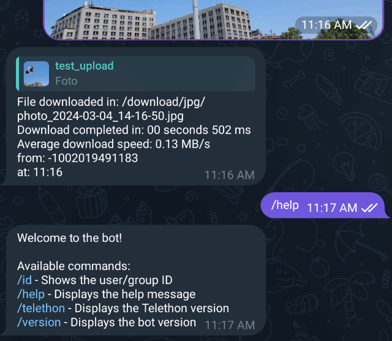
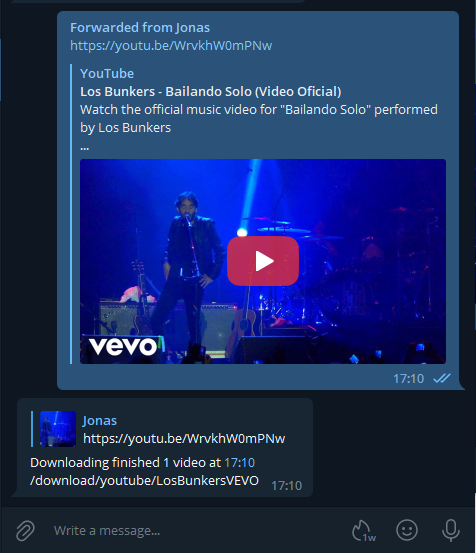

# Telethon Downloader

[](https://github.com/jsavargas/telethon_downloader)
[](https://hub.docker.com/r/jsavargas/telethon_downloader)
[](https://hub.docker.com/r/jsavargas/telethon_downloader/)
[](https://hub.docker.com/r/jsavargas/telethon_downloader/)
[](https://hub.docker.com/r/jsavargas/telethon_downloader/)


## Encuéntranos en:

[](https://github.com/jsavargas/telethon_downloader)
[](https://hub.docker.com/r/jsavargas/telethon_downloader)
[](https://discord.gg/FdJMau8sf6)

<p align="center">
    
</p>

# [jsavargas/telethon_downloader](https://github.com/jsavargas/telethon_downloader)

# Bot de Telegram con Descarga Automática

Este Bot de Telegram, basado en el cliente [Telethon](https://github.com/LonamiWebs/Telethon), está diseñado para descargar automáticamente archivos multimedia que se le envíen. Además, puede descargar vídeos o audios de YouTube y enlaces directos a archivos mediante su URL, gestionando inteligentemente archivos `.torrent` al pasarlos al cliente torrent configurado.

# Características

- **Descargas Automáticas**: Descarga automáticamente archivos enviados al bot, incluyendo medios enviados juntos como álbum/grupo.
- **Reanudación de Descargas Pendientes**: Al iniciar, el bot puede preguntar si se desean reanudar las descargas que fueron interrumpidas o estaban pendientes de una sesión anterior.
- **Cancelar Descargas en Curso**: Se muestra un botón inline "Cancel Download" mientras un archivo se está descargando.
- **YouTube y Enlaces Directos**: Descarga vídeos/audios de YouTube —incluyendo listas de reproducción, con la opción de traer solo el primer vídeo o la lista completa, y de obtener Vídeo, Audio o Ambos— además de archivos desde URLs directas.
- **Soporte Torrent**: Maneja archivos `.torrent` y enlaces magnet mediante un cliente torrent configurado (API de qBittorrent, con selección de categoría, o carpeta de vigilancia).
- **Organización de Archivos**:
    - Clasifica archivos en carpetas según extensión, ID de grupo/canal, o palabras clave/regex en el nombre del archivo.
    - Clasificación por defecto: los archivos completados se mueven a una subcarpeta `completed` y las descargas temporales a una subcarpeta `incompleted` dentro de la ruta base.
    - Rutas personalizables vía `config.ini` o comandos del bot.
- **Resolución de Conflictos**: Compara hashes MD5 de archivos existentes para evitar duplicados, añadiendo sufijos numéricos cuando el contenido difiere.
- **Comandos Interactivos**:
    - `/rename`: Renombrar archivos descargados.
    - `/addpath`: Menú interactivo para configurar rutas de descarga.
    - `/addextensionpath` y `/addgrouppath`: Configura rutas rápidamente con un solo comando.
    - `/id`: Muestra tu ID de usuario o el ID del origen del mensaje respondido.
- **Explorador de Directorios**: Navegador interactivo para elegir carpeta de destino —se muestra al terminar cada descarga (con opciones "Move"/"Ok") y al configurar rutas vía `/addpath`. Incluye funciones "Atrás" y "Nueva Carpeta", y puede mover un grupo completo de archivos a la vez.

¡Disfruta de una experiencia de descarga automatizada y organizada con telethon_downloader!





# Ejecución de Telethon Downloader

## Variables de Entorno:

Descarga o construye la imagen docker y lánzala con las siguientes variables:

- **TG_AUTHORIZED_USER_ID** (o **AUTHORIZED_USER_ID**): ID de chat de Telegram autorizado. Soporta una lista de IDs separados por comas (ej: `123456,789012`).
- **TG_API_ID** (o **API_ID**): Clave API de Telegram generada en [my.telegram.org](https://my.telegram.org/).
- **TG_API_HASH** (o **API_HASH**): Hash API de Telegram.
- **TG_BOT_TOKEN** (o **BOT_TOKEN**): Token de Telegram BOT generado vía [@BotFather](https://telegram.me/botfather).
- **DOWNLOAD_PATH** (o **TG_DOWNLOAD_PATH**) [OPCIONAL]: Ruta base para descargas completadas (por defecto: `/download`). Los archivos se clasificarán en subcarpetas `completed` e `incompleted`.
- **DOWNLOAD_PATH_TORRENTS** [OPCIONAL]: Carpeta para archivos `.torrent` en modo `watch` (por defecto: `/watch`).
- **PATH_CONFIG** [OPCIONAL]: Ruta donde se guardan los archivos de configuración e historial (por defecto: `/config/`).
- **TORRENT_MODE** [OPCIONAL]: Modo de manejo de torrents. `qbittorrent` para integración por API, o `watch` para carpeta de vigilancia (por defecto: `watch`).
- **QBT_HOST** [REQUERIDO si TORRENT_MODE es 'qbittorrent']: Host o IP de la interfaz web de qBittorrent.
- **QBT_PORT** [OPCIONAL]: Puerto de la interfaz web de qBittorrent (por defecto: `8080`).
- **QBT_USERNAME** [OPCIONAL]: Usuario para autenticación en qBittorrent.
- **QBT_PASSWORD** [OPCIONAL]: Contraseña para autenticación en qBittorrent.
- **PUID** [OPCIONAL]: ID de usuario para la propiedad de los archivos.
- **PGID** [OPCIONAL]: ID de grupo para la propiedad de los archivos.
- **TZ** [OPCIONAL]: Zona horaria del sistema (ej: `America/Santiago`).
- **TG_MAX_PARALLEL** (o **MAX_CONCURRENT_TASKS**) [OPCIONAL]: Máximo de descargas paralelas (por defecto: `4`).
- **TG_PROGRESS_DOWNLOAD** (or **PROGRESS_DOWNLOAD**) [OPCIONAL]: Mostrar progreso de descarga (por defecto: `True`).
- **PROGRESS_STATUS_SHOW** [OPCIONAL]: Frecuencia de actualización del progreso en porcentaje (por defecto: `10`).
- **YOUTUBE_FORMAT_VIDEO** [OPCIONAL]: Formato de vídeo de YouTube (por defecto: `bestvideo[ext=mp4]+bestaudio[ext=m4a]/best[ext=mp4]/best`).
- **YOUTUBE_FORMAT_AUDIO** [OPCIONAL]: Formato de audio de YouTube (por defecto: `bestaudio/best`).
- **YOUTUBE_DEFAULT_DOWNLOAD** [OPCIONAL]: Elección por defecto para YouTube: `video` o `audio` (por defecto: `video`).
- **YOUTUBE_TIMEOUT_OPTION** [OPCIONAL]: Segundos de espera para elegir formato antes de usar el defecto (por defecto: `5`).
- **YOUTUBE_VIDEO_FOLDER** [OPCIONAL]: Ruta para vídeos de YouTube (por defecto: `/download/youtube/videos`).
- **YOUTUBE_AUDIO_FOLDER** [OPCIONAL]: Ruta para audios de YouTube (por defecto: `/download/youtube/audios`).

## Volúmenes:

- **/config**: Archivos de configuración, `config.ini`, descargas pendientes e historial.
- **/download**: Carpeta principal de descargas.
- **/watch**: Carpeta de vigilancia para torrents (si `TORRENT_MODE=watch`).

# Archivo de Configuración: config.ini

El archivo `config.ini` organiza las descargas en rutas específicas según reglas.

**Orden de Precedencia:**
1. `KEYWORDS`
2. `REGEX_PATH`
3. `GROUP_PATH`
4. `EXTENSIONS`

### [EXTENSIONS]
```ini
[EXTENSIONS]
mp4 = /download/videos
pdf = /download/documents
```

### [GROUP_PATH]
```ini
[GROUP_PATH]
-100118xxxxxxxx = /download/channel_content
```

### [KEYWORDS]
```ini
[KEYWORDS]
tutorial = /download/tutorials
```

### [REGEX_PATH]
Soporte para coincidencias insensibles a mayúsculas con `/patron/i`.
```ini
[REGEX_PATH]
/Halo/i = /download/Series/Halo
```

### [REMOVE_PATTERNS]
Define patrones a eliminar de los nombres de archivo por grupo o globalmente (`*`).
```ini
[REMOVE_PATTERNS]
* = _compressed, [720p]
-100123456 = tag_del_canal
```

# Comandos Disponibles

- `/id`: Muestra tu ID de usuario o el ID del origen del mensaje respondido.
- `/version`: Muestra la versión del bot y dependencias internas.
- `/start`: Muestra el mensaje de bienvenida y ayuda.
- `/help`: Muestra los comandos disponibles.
- `/rename`: Renombra un archivo respondiendo a él: `/rename <nuevo_nombre>`.
- `/addpath`: Menú interactivo para añadir rutas de descarga.
- `/addextensionpath`: Uso: `/addextensionpath <ext> <ruta>` o responde a un archivo.
- `/addgrouppath`: Uso: `/addgrouppath <id> <ruta>` o responde a un mensaje.

# Generación de claves API de Telegram

1. Visita [my.telegram.org](https://my.telegram.org/).
2. Inicia sesión y ve a "API Development tools".
3. Crea una nueva aplicación para obtener tu **API ID** y **API Hash**.

# Creación de un Bot de Telegram

1. Contacta a [@BotFather](https://telegram.me/botfather) en Telegram.
2. Usa `/newbot` y sigue las instrucciones para obtener tu **Bot Token**.

# Ejemplo de Docker Compose

```yaml
version: '3'
services:
  telethon_downloader:
    image: jsavargas/telethon_downloader
    container_name: telethon_downloader
    restart: unless-stopped
    network_mode: host
    environment:
      - PUID=1000
      - PGID=1000
      - TG_API_ID=tu_api_id
      - TG_API_HASH=tu_api_hash
      - TG_BOT_TOKEN=tu_bot_token
      - TG_AUTHORIZED_USER_ID=tu_id_usuario
      - TORRENT_MODE=qbittorrent
      - QBT_HOST=192.168.1.10
      - TZ=America/Santiago
    volumes:
      - /path/to/config:/config
      - /path/to/download:/download
      - /path/to/watch:/watch
```

# Historial de Cambios

## [Versión 4.0.15] - 2026-06-05
- **Documentación:** Actualizado el README con variables de entorno y características faltantes.
- **Documentación:** Aclarado que el ID de usuario autorizado soporta listas separadas por comas.
- **Documentación:** Añadidos detalles sobre los subdirectorios `completed` e `incompleted` por defecto.
- **Documentación:** Mención explícita de la función de Reanudación de Descargas Pendientes.

## [Versión 4.0.14] - 2026-03-15
- **Mantenimiento:** Actualización de dependencias internas y estabilidad del bot.
- **Mantenimiento:** Correcciones de errores generales.

## [Versión 4.0.13] - 2025-12-05
- **Funcionalidad:** Implementada resolución robusta de conflictos usando hashes MD5.
- **Mejora:** Mejorada la precisión de los resúmenes de descarga.

... (resto del historial)
