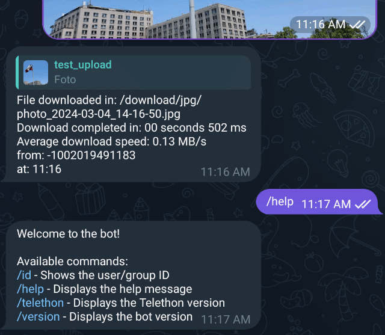
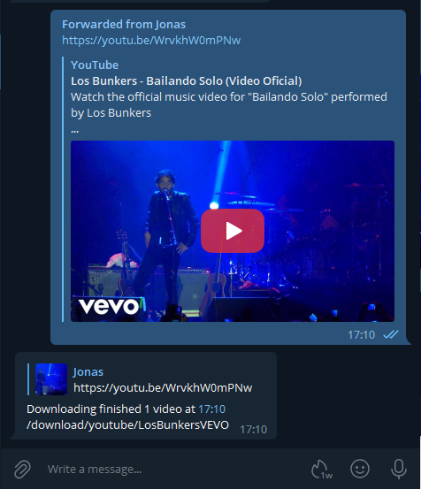

# Telethon Downloader

[](https://github.com/jsavargas/telethon_downloader)
[](https://hub.docker.com/r/jsavargas/telethon_downloader)
[](https://hub.docker.com/r/jsavargas/telethon_downloader/)
[](https://hub.docker.com/r/jsavargas/telethon_downloader/)
[](https://hub.docker.com/r/jsavargas/telethon_downloader/)


## Find us at:

[](https://github.com/jsavargas/telethon_downloader)
[](https://hub.docker.com/r/jsavargas/telethon_downloader)
[](https://discord.gg/FdJMau8sf6)


<p align="center">
    
</p>


# [jsavargas/telethon_downloader](https://github.com/jsavargas/telethon_downloader)


# Telegram Bot with Automatic Download

This Telegram Bot, based on the [Telethon](https://github.com/LonamiWebs/Telethon) client, is designed to automatically download multimedia files sent to it. Additionally, it now has the capability to download videos or audios from YouTube and direct links to files via their URL.

### What's new in this version:

- **File Organization:**
  - Downloaded files are sorted into folders based on their extension.
  - Downloaded files can be organized into folders based on their name using regular expressions.
  - Files forwarded from groups are stored in specific folders identified by the group ID, allowing for more precise and customized organization (configurable in the .ini file).

- **Extended Functionality:**
  - Added the ability to download files via links.
  - Implemented file renaming, zip, and rar file decompression features.
  - Introduced the capability to download YouTube videos or audio.
  - Enabled support for multiple languages in bot messages.
  - Introduced options to set permissions for downloaded and bot-generated folders and files.
  - Added functionality to set paths for downloaded YouTube audios and videos.


Enjoy an automated and organized downloading experience with telethon_downloader!





# Running Telethon Downloader

## Environment:

 Pull or build the docker image and launch it with the following environment variables:

 **TG_AUTHORIZED_USER_ID** : <telegram ´chat_id´ authorized> 
>NOTE: Unique identification of the user who has permissions to send files to the bot.

 **TG_API_ID** : <telegram API key generated at ´Generating Telegram API keys´>

 **TG_API_HASH** : <telegram API hash generated at ´Generating Telegram API keys´>

 **TG_BOT_TOKEN** : <telegram BOT token generated at ´Creating a Telegram Bot´>
 
 **TORRENT_MODE** [OPTIONAL]: <Mode for torrent handling. Set to 'qbittorrent' to enable qBittorrent API integration, or 'watch' for watch folder (default: watch)>

 **QBT_HOST** [REQUIRED if TORRENT_MODE is 'qbittorrent']: <Hostname or IP address of the qBittorrent Web UI.>

 **QBT_PORT** [REQUIRED if TORRENT_MODE is 'qbittorrent']: <Port of the qBittorrent Web UI (default: 8080)>

 **QBT_USERNAME** [OPTIONAL]: <Username for qBittorrent Web UI authentication.>

 **QBT_PASSWORD** [OPTIONAL]: <Password for qBittorrent Web UI authentication.>

 **PUID** [OPTIONAL]: <Unique identification of the user in the system, used for assigning permissions.> 

 **PGID** [OPTIONAL]: <Unique identifier for a group of users, used for assigning specific permissions to the group.> 

**PERMISSIONS_FOLDER** [OPTIONAL]: <Folder permissions. (default: 777)>

**PERMISSIONS_FILE** [OPTIONAL]: <File permissions. (default: 755)>

 **TZ** [OPTIONAL]: <Sets the system timezone, adjusting it based on the geographical location of the server or user.> 
 >Example: America/Santiago

 **TG_MAX_PARALLEL** [OPTIONAL]: <maximum number of parallel downloads allowed (default: 4)>

 **TG_DL_TIMEOUT** [OPTIONAL]: <maximum time (in seconds) to wait for a download to complete. after this time the download is cancelled and an error is triggered (default: 3600)>

 >NOTE: DOWNLOADED FILES ARE SAVED AT A TMP DIRECTORY UNTIL THE DOWNLOAD IS COMPLETED TO PROTECT FROM MOVING UNFINISHED FILES

**TG_PROGRESS_DOWNLOAD** [OPTIONAL]: <Show download progress (default: True)>

**PROGRESS_STATUS_SHOW** [OPTIONAL]: <Show download progress every 10% (default: 10)>

**YOUTUBE_FORMAT_AUDIO** [OPTIONAL]: <YouTube audio download format (default: bestaudio/best)>

**YOUTUBE_FORMAT_VIDEO** [OPTIONAL]: <YouTube video download format (default: bestvideo+bestaudio/best)>

**YOUTUBE_DEFAULT_DOWNLOAD** [OPTIONAL]: <Automatic YouTube download preference, AUDIO or VIDEO (default: VIDEO)>

**YOUTUBE_DEFAULT_EXTENSION** [OPTIONAL]: <Extension format for downloading YouTube videos (default: MKV)>

**YOUTUBE_SHOW_OPTION** [OPTIONAL]: <Show or hide buttons to select YouTube Video or Audio download (default: True)>

**YOUTUBE_TIMEOUT_OPTION** [OPTIONAL]: <Time in which buttons are displayed to download YouTube Video or Audio before the default option "**YOUTUBE_DEFAULT_DOWNLOAD**" is chosen (default: 5)>
 
**YOUTUBE_AUDIO_FOLDER** [OPTIONAL]: <Folder where YouTube audios will be downloaded (default: /download/youtube)>
>NOTE: To add a new path to these variables, remember to map them in the "volumes" section in docker.

**YOUTUBE_VIDEO_FOLDER** [OPTIONAL]: <Folder where YouTube videos will be downloaded (default: /download/youtube)>
>NOTE: To add a new path to these variables, remember to map them in the "volumes" section in docker.

 **YOUTUBE_LINKS_SUPPORTED** [OPTIONAL]: <YouTube links supported for downloading videos (default: youtube.com,youtu.be)>
>NOTE: NOTE: THIS VARIABLE MUST BE UPDATED IF MORE URL IS REQUIRED TO BE ADDED TO THE YOUTUBE DOWNLOAD SUPPORT

## Volumes:

- **/config:** Path where configuration files, pending downloads, and recent downloads are stored.

- **/download:** Folder where files are downloaded.
  
- **/watch:** Folder where torrent files are downloaded, and transmission will upload them.


# Config File: config.ini
A config.ini file is created that contains file extensions and paths where these files should be downloaded based on:

**Download order by rules:**

- KEYWORDS
- GROUP_PATH
- REGEX_PATH
- EXTENSIONS

## By file extension

```ini
[EXTENSIONS]
mp4 = /download/mp4
```

## By forwarded groups

```ini
[GROUP_PATH]
-100118xxxxxxxx = /download/games
```

## By file name

```ini
[REGEX_PATH]
/Halo/i = /download/Serie YYYYYY
```

## Example

```ini
[EXTENSIONS]
pdf = /download/pdf
cbr = /download/pdf
mp3 = /download/mp3
flac = /download/mp3
jpg = /download/jpg
mp4 = /download/mp4
mobi = /download/mobi

[GROUP_PATH]
-10012345789 = /download/1001234577

[KEYWORDS]
tanganana = /download/tanganana

[REGEX_PATH]
/example/i = /download/example

[REMOVE_PATTERNS]
* = tif_,[tof_,0001
-100123456 = tif_
```

# Available Commands

- help                   
- pyrogram               
- ytdlp                  
- version                
- id                     
- rename                 
- move                   
- addextensionpath       
- delextensionpath       
- addgrouppath           
- delgrouppath           
- addkeywordpath         
- delkeywordpath         
- addrenamegroup         
- delrenamegroup         


# Generating Telegram API keys

Before working with Telegram's API, you need to get your own API ID and hash:

1. Go to https://my.telegram.org/ and login with your
   phone number.

2. Click under API Development tools.

3. A *Create new application* window will appear. Fill in your application
   details. There is no need to enter any *URL*, and only the first two
   fields (*App title* and *Short name*) can currently be changed later.

4. Click on *Create application* at the end. Remember that your
   **API hash is secret** and Telegram won't let you revoke it.
   Don't post it anywhere!

# Creating a Telegram Bot

1. Open a conversation with [@BotFather](https://telegram.me/botfather) in Telegram

2. Use the /newbot command to create a new bot. The BotFather will ask you for a name and username, then generate an authorization token for your new bot.

   The name of your bot is displayed in contact details and elsewhere.

   The Username is a short name, to be used in mentions and telegram.me links. Usernames are 5-32 characters long and are case insensitive, but may only include Latin characters, numbers, and underscores. Your bot's username must end in ‘bot’, e.g. ‘tetris_bot’ or ‘TetrisBot’.

   The token is a string along the lines of 110201543:AAHdqTcvCH1vGWJxfSeofSAs0K5PALDsaw that is required to authorize the bot and send requests to the Bot API. Keep your token secure and store it safely, it can be used by anyone to control your bot.


# Get PUID and PGID in Linux
If you need to obtain the PUID (User ID) and PGID (Group ID) in Linux, you can easily do so with the following commands:

Make sure to replace <USER> with the username for which you want to obtain the information. These commands will provide you with the corresponding user and group identifiers.

## PUID
```bash
id -u <USUARIO>
```
## PGID
```bash
id -g <USUARIO>
```

## Example

```bash
root@Jonas > id -u nobody
99
root@Jonas > id -g nobody
100
```

# docker-compose

```dockerfile
version: '3'

services:

  telethon_downloader:
    image: jsavargas/telethon_downloader
    container_name: telethon_downloader
    restart: unless-stopped
    network_mode: host
    environment:
      - PUID=99
      - PGID=100
      - API_ID=
      - API_HASH= 
      - BOT_TOKEN=
      - AUTHORIZED_USER_ID=                             #<telegram chat_id authorized>
      - TZ=America/Santiago
      - TG_MAX_PARALLEL=3                               # OPTIONAL
      - TG_DL_TIMEOUT=4600                              # OPTIONAL
      - TG_PROGRESS_DOWNLOAD=True                       # OPTIONAL (True/False)
      - PROGRESS_STATUS_SHOW=10                         # OPTIONAL (10)
      - YOUTUBE_FORMAT_AUDIO=bestaudio/best             # OPTIONAL (bestaudio/best)
      - YOUTUBE_FORMAT_VIDEO=bestvideo+bestaudio/best   # OPTIONAL (bestvideo[ext=mp4]+bestaudio[ext=m4a]/best[ext=mp4]/best)
      - YOUTUBE_DEFAULT_DOWNLOAD=VIDEO                  # OPTIONAL (AUDIO/VIDEO) 
      - YOUTUBE_DEFAULT_EXTENSION=MKV                   # OPTIONAL (mkv/mp4) 
      - YOUTUBE_SHOW_OPTION=True                        # OPTIONAL (True/False)
      - YOUTUBE_TIMEOUT_OPTION=5                        # OPTIONAL (5)
      - YOUTUBE_AUDIO_FOLDER=/youtube/audio             # OPTIONAL
      - YOUTUBE_VIDEO_FOLDER=/youtube/video             # OPTIONAL
      - TORRENT_MODE=qbittorrent                        # OPTIONAL (watch/qbittorrent)  
      - QBT_HOST=192.168.1.10                           # OPTIONAL        
      - QBT_PORT=8080                                   # OPTIONAL
      - QBT_USERNAME=admin                              # OPTIONAL
      - QBT_PASSWORD=adminadmin                         # OPTIONAL
    volumes:
      - /path/to/config:/config
      - /path/to/download:/download
      - /path/to/watch:/watch
      - /path/to/youtube:/youtube
```


# Changelog

## Backlog (Upcoming Features)
- **Feature:** Move Files - Implement the ability to move files to new locations.
- **Feature:** Rename Files - Develop functionality to rename files from the bot.
- **Feature:** Unzip Files - Add the capability to unzip files directly from the bot.
- **Feature:** Unrar Files - Add the capability to unrar files directly from the bot.


## [Version 4.0.10] - 2025-08-06
- **Feature:** Implemented torrent category selection when adding new torrents via qBittorrent API. Users can now choose from existing categories or add a new one.
- **Fix:** Improved resume functionality for pending downloads, ensuring media is correctly retrieved and downloads can be resumed after bot restarts.
- **Fix:** Resolved issue where category selection buttons would reappear after torrent processing.

## [Version 4.0.8] - 2025-02-28
- **Update:** Updated `telethon` to version 1.39.0.
- **Update:** Updated `yt_dlp` to version 2025.02.19.

## [Version 4.0.7] - 2024-06-23
- **Update:** Updated `telethon` to version 1.37.0.
- **Update:** Updated `yt_dlp` to version 2024.11.04.

## [Version 4.0.6] - 2024-06-23
- **Update:** Updated `yt_dlp` to version 2024.08.06.

## [Version 4.0.5] - 2024-06-23
- **Update:** Updated `telethon` to version 1.36.0.
- **Update:** Updated `yt_dlp` to version 2024.05.27.
- **Fix:** Corrected the download of YouTube audios in MP3 format.

## [Version 4.0.4] - 2024-03-04
- **Enhancement:** Re-enabled `MESSAGE_NO_LINKS_DOWNLOAD` feature.

## [Version 4.0.3] - 2024-03-03
- **Feature:** Added environment variable for YouTube video and audio download path.
- **Feature:** Implemented file renaming functionality using the /rename command, followed by the new name, using a reply on the file or download message.
- **Feature:** Added a function to move files to a new folder (under development).
- **Feature:** Improved creation of new folders, permission changes, and owner changes for files.
- **Feature:** Added environment variables to set permissions for folders and files.
- **Feature:** Created the file `/config/download_files.json` to track the last 500 downloaded files, including download dates, original file names, and, if renamed, the new names along with the renaming date.

## [Version 4.0.2] - 2024-02-19
- **Feature:** download youtube videos in mkv/mp4.

## [Version 4.0.1] - 2024-02-17
- **Enhancement:** Completely restructured the code.
- **Enhancement:** Group downloads by extension, file names, and group IDs.
- **Enhancement:** Implemented immediate download for torrent files without queuing.
- **Enhancement:** Added language templates for en_EN and es_ES.
- **Enhancement:** Templates are stored in the /config/locale path.
- **Enhancement:** They are automatically initialized if they do not exist.
- **Enhancement:** Any language added in the docker-compose that does not have an existing template will default to English.
- **Enhancement:** Implemented retry for downloads from a pending_messages.json file when downloads are pending.
- **Enhancement:** Background tasks for handling `download_pending_messages`.
- **Enhancement:** Progress indication during downloads now includes percentage and download speed.
- **Enhancement:** Increased timeout by 30 minutes for failed downloads due to timeout.
- **Enhancement:** Improved messaging during download progress.
- **Feature:** Added buttons for downloading audio or video from YouTube.
- **Feature:** Added support for downloading links.
- **Feature:** Implemented the ability to unzip both zip and rar files.
- **Feature:** Display Telethon version information.
- **Feature:** Upgrade Telethon version to 1.34.0.
- **Feature:** Append ".tmp" to downloaded files and rename them after completion.

## [Version 3.1.13] - 2024.01.10
- upgrade telethon to version 1.33.1

## [Version 3.1.12] - 2023.08.17
- upgrade yt-dlp to version 2023.07.06

## [Version 3.1.11] - 2023.03.31
- upgrade python to version 3.11

## [Version 3.1.10] - 2023.02.28
- upgrade python to version 3.11

## [Version 3.1.9] - 2023.02.01
- upgrade telethon to version 1.26.1

## [Version 3.1.8] - 2022.10.10
- change docker building

## [Version 3.1.7] - 2022.09.30
- change youtube-dlp to yt-dlp
- Fixed bugs
- Added more bugs to fix later (?) xD

## [Version 3.0.1] - 2021.10.28
- Added config.ini file in /config
- Added regex support
